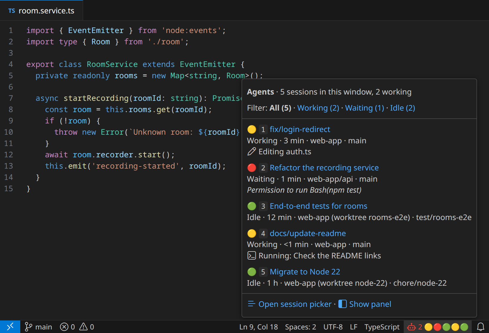
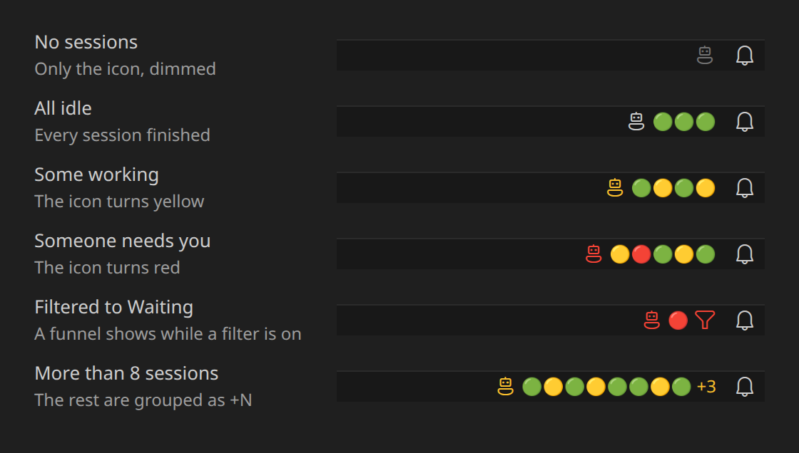
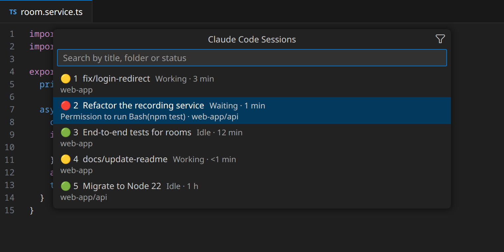

# Agent Status

A status bar chip that shows every running coding agent session at a glance: an agent icon followed by one dot per session. For now it supports [Claude Code](#supported-agents).

<p align="center">
  
</p>

| Dot | Status  | Meaning                               |
| --- | ------- | ------------------------------------- |
| 🟡  | Working | The agent is running a turn           |
| 🔴  | Waiting | It needs your permission or an answer |
| 🟢  | Idle    | It finished and is ready for more     |

The icon takes the color of the most urgent status: red if any session is waiting, yellow if any is working.

<p align="center">
  
</p>

## Supported agents

Agent Status is not tied to a single agent, but for now it supports only Claude Code.

| Agent                                  | Support                         | Needs                                                                       |
| -------------------------------------- | ------------------------------- | --------------------------------------------------------------------------- |
| [Claude Code](https://code.claude.com) | Supported (tested with 2.1.285) | The Claude Code extension for VS Code, or the `claude` CLI in a VS Code terminal |

Sessions open in the Claude Code extension's chat; CLI sessions focus their terminal instead. It works best on Linux; see [Limitations](#limitations).

This is a community project, not affiliated with or endorsed by Anthropic.

## Using it

- **Hover the chip** to see the sessions in the same order as the dots, numbered, each with its title, status, time in that status and folder. Click a title to open that session. The filter links at the top (All · Working · Waiting · Idle) choose which dots the chip shows.
- **Click the chip** to open a searchable session picker. The first waiting session is highlighted, so Enter takes you to it. The funnel button in its title bar opens the status filter.
- A funnel appears in the chip while a filter is active. The filter is remembered across restarts.

<p align="center">
  
</p>

_The images are mockups drawn by `docs/render.js` with made-up sessions, using VS Code's icons and Dark Modern colors._

Clicking a session shows it in Claude Code:

- If the session already has its own tab, that tab comes to the front.
- Otherwise the Claude Code sidebar switches to that session, instead of a new editor tab opening.

Claude Code only lets another extension show a session in its sidebar when its **Preferred Location** (`claudeCode.preferredLocation`) is `sidebar` at the moment of the call. When yours is `panel`, the extension sets it to `sidebar` just for the click and restores your value right after (two quick writes to your user settings), so new chats keep opening where you chose. Set `agentStatus.openIn` to `preferredLocation` to skip that and open sessions wherever your Preferred Location says, like Claude Code's own session list.

Sessions running in an integrated terminal focus that terminal instead.

### Sounds

A sound plays when a session in this window changes state, so you can look away while agents work:

| When                                    | Sound        | Hear it with                      | Turn it off                  | Use your own `.wav`            |
| --------------------------------------- | ------------ | --------------------------------- | ---------------------------- | ------------------------------ |
| It finishes its turn (working → idle)   | "blip"       | **Agent Status: Play Finish Sound**  | `agentStatus.soundOnFinish`  | `agentStatus.finishSoundFile`  |
| It needs your decision (working → waiting), such as a permission request | A short alert | **Agent Status: Play Waiting Sound** | `agentStatus.soundOnWaiting` | `agentStatus.waitingSoundFile` |

Several sessions changing at the same moment make one sound, and if one finishes while another starts waiting, only the waiting sound plays. Each window only sounds for its own sessions. Sounds are played with the system player (`pw-play`, `paplay` or `aplay` on Linux, `afplay` on macOS). The finish blip is generated by `scripts/make-sounds.js`; the waiting sound is a recording by another author (see [Credits](#credits)).

## How it works

Claude Code writes one record per running session to `~/.claude/sessions/<pid>.json` (or `$CLAUDE_CONFIG_DIR/sessions`) with its `status` (`busy`, `waiting`, `idle`), `cwd` and start time. The extension watches that directory and re-checks every 5 seconds. It only reads the `.json` records, never the `.key` files next to them.

- **Liveness:** a record whose process is gone, or whose PID was reused by another process, is ignored.
- **Titles:** the tab name you gave the session, otherwise the title Claude generated, read from the end of the session transcript in `~/.claude/projects/`.
- **Which window owns a session (Linux):** chats opened by the Claude Code extension are child processes of the window's extension host; CLI sessions descend from one of the window's terminal shells. The extension walks `/proc` to tell them apart.

Nothing leaves the machine: no network calls, no telemetry.

### Reliability

- **Your Preferred Location is always given back.** The borrowed value is restored as soon as Claude Code starts opening the session, or after 3 seconds if it does not answer. A marker in the extension's storage makes the next start restore it if VS Code dies mid-click. Workspace settings (`.vscode/settings.json`) are never edited: if the preference is set there, sessions open where it says. If your user settings cannot be written, the session still opens, just without the sidebar switch.
- **Nothing blocks VS Code.** Files are read asynchronously; a terminal that never reports its process, a refresh that hangs or an audio player that gets stuck are all cut off after a timeout.
- **Odd data is skipped, not shown.** Half-written records, invalid fields, records from another machine or PID namespace (a dev container sharing `~/.claude`), dead processes and reused PIDs are ignored. Two processes on the same session show as one dot. Titles are escaped before they reach the hover, which runs trusted command links.
- **Invalid settings fall back to their defaults.**
- Problems are written to the **Agent Status** output channel (**Agent Status: Show Log**), once per distinct problem.

## Settings

| Setting                                | Default          | Description                                                                                        |
| -------------------------------------- | ---------------- | -------------------------------------------------------------------------------------------------- |
| `agentStatus.scope`              | `window`         | `window`: sessions started from this window. `workspace`: also others inside this workspace. `all`: every session on the machine. |
| `agentStatus.openIn`             | `sidebar`        | `sidebar`: show sessions in the Claude Code sidebar. `preferredLocation`: open them where Claude Code's Preferred Location says. |
| `agentStatus.soundOnFinish`      | `true`           | Play a blip when a session in this window finishes its turn.                                       |
| `agentStatus.soundOnWaiting`     | `true`           | Play an alert when a session in this window waits for your decision.                              |
| `agentStatus.finishSoundFile`    | (empty)          | `.wav` file to play instead of the built-in finish blip.                                           |
| `agentStatus.waitingSoundFile`   | (empty)          | `.wav` file to play instead of the built-in waiting sound.                                         |
| `agentStatus.order`              | `stable`         | `stable`: start order, every dot keeps its place. `status`: waiting first, then working, then idle. |
| `agentStatus.icon`               | `robot`          | Codicon at the start of the chip, e.g. `sparkle`.                                                  |
| `agentStatus.iconReflectsStatus` | `true`           | Color the icon with the most urgent status.                                                        |
| `agentStatus.maxDots`            | `8`              | Dots shown before the rest are grouped as `+N`.                                                    |
| `agentStatus.hideWhenEmpty`      | `false`          | Hide the chip when no sessions are running.                                                        |
| `agentStatus.dots`               | `🟡 🔴 🟢`       | Character for each status (`busy`, `waiting`, `idle`).                                             |

Sessions that belong to another window or to a terminal outside VS Code are shown with the `workspace` and `all` scopes, but are not opened from here: attaching a second client to a running session would conflict with it.

## Limitations

- `~/.claude/sessions/*.json` is an internal Claude Code format, not a documented API. If an update changes it, the chip may stop showing sessions; Claude Code itself is unaffected.
- A status bar item takes a single text color and a single click target. That is why the dots are emoji, and why sessions are opened from the hover or the picker rather than by clicking an individual dot.
- Window ownership needs `/proc` (Linux). Elsewhere, sessions inside the workspace folders count as this window's.

## Build and install

No dependencies are needed, only `node` (18 or later), `zip` and VS Code's `code` command:

```sh
git clone https://github.com/CSantosM/agent-status.git
cd agent-status
./package.sh --install
```

It runs the tests first and refuses to package if any fails. Then run **Developer: Reload Window** in each open VS Code window. To uninstall: `code --uninstall-extension local.agent-status`.

## Development

| Path            | What it holds                                                                  |
| --------------- | ------------------------------------------------------------------------------ |
| `extension.js`  | Everything that talks to VS Code: the chip, hover, picker and opening sessions |
| `src/sessions.js` | Reading session records, liveness, window ownership, deduplication           |
| `src/titles.js` | Session titles from the transcripts                                            |
| `src/sound.js`  | The finish and waiting sounds and their audio player fallbacks                 |
| `src/util.js`   | Formatting and timeout helpers                                                 |
| `test/`         | `node:test` suites; `test/helpers.js` stands in for the `vscode` module        |
| `docs/render.js` | Draws the README images in `docs/images` with headless Chrome (`node docs/render.js`) |

Run the tests with `npm test` (or `node --test 'test/*.test.js'`). The extension tests start real `sleep` processes to stand in for Claude sessions, so they need Linux.

## Credits and license

The code is under the [MIT License](LICENSE).

`media/waiting.wav`, the waiting sound, is by Mattias "MATRIXXX" Lahoud (2020), used under a [Creative Commons Attribution](https://creativecommons.org/licenses/by/4.0/) license, as its metadata states (without naming the version). It is not covered by the MIT License.
